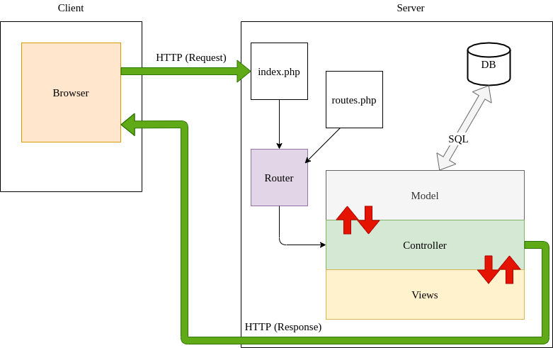

# Simple MVC

## Description

This repository is a simple PHP MVC structure from scratch.

It uses some cool vendors/libraries such as Twig and Grumphp.
For this one, just a simple example where users can choose one of their databases and see tables in it.

## Steps

1. Clone the repo from Github.
2. Run `composer install`.
3. Create _config/db.php_ from _config/db.php.dist_ file and add your DB parameters. Don't delete the _.dist_ file, it must be kept.

```php
define('APP_DB_HOST', 'your_db_host');
define('APP_DB_NAME', 'your_db_name');
define('APP_DB_USER', 'your_db_user_wich_is_not_root');
define('APP_DB_PASSWORD', 'your_db_password');
```

4. Import _database.sql_ in your SQL server, you can do it manually or use the _migration.php_ script which will import a _database.sql_ file.
5. Run the internal PHP webserver with `php -S localhost:8000 -t public/`. The option `-t` with `public` as parameter means your localhost will target the `/public` folder.
6. Go to `localhost:8000` with your favorite browser.
7. From this starter kit, create your own web application.

### Windows Users

If you develop on Windows, you should edit you git configuration to change your end of line rules with this command :

`git config --global core.autocrlf true`

## Example

An example (a basic list of items) is provided (you can load the _simple-mvc.sql_ file in a test database). The accessible URLs are :

-   Home page at [localhost:8000/](localhost:8000/)
-   Items list at [localhost:8000/items](localhost:8000/items)
-   Item details [localhost:8000/items/show?id=:id](localhost:8000/item/show?id=2)
-   Item edit [localhost:8000/items/edit?id=:id](localhost:8000/items/edit?id=2)
-   Item add [localhost:8000/items/add](localhost:8000/items/add)
-   Item deletion [localhost:8000/items/delete?id=:id](localhost:8000/items/delete?id=2)

You can find all these routes declared in the file `src/routes.php`. This is the very same file where you'll add your own new routes to the application.

## How does URL routing work ?



## Ask for a tour !


We prepare a little guided tour to start with the simple-MVC.

To take it, you need to install the `Code Tour` extension for Visual Studio Code : [Code Tour](https://marketplace.visualstudio.com/items?itemName=vsls-contrib.codetour)

It will give access to a new menu on your IDE where you'll find the different tours about the simple-MVC. Click on play to start one :


## Run it on docker

If you don't know what is docker, skip this chapter. ;)

Otherwise, you probably see, this project is ready to use with docker.

To build the image, go into the project directory and in your CLI type:

```
docker build -t simple-mvc-container .
```

then, run it to open it on your localhot :

```
docker run -i -t --name simple-mvc  -p 80:80 simple-mvc-container
```
